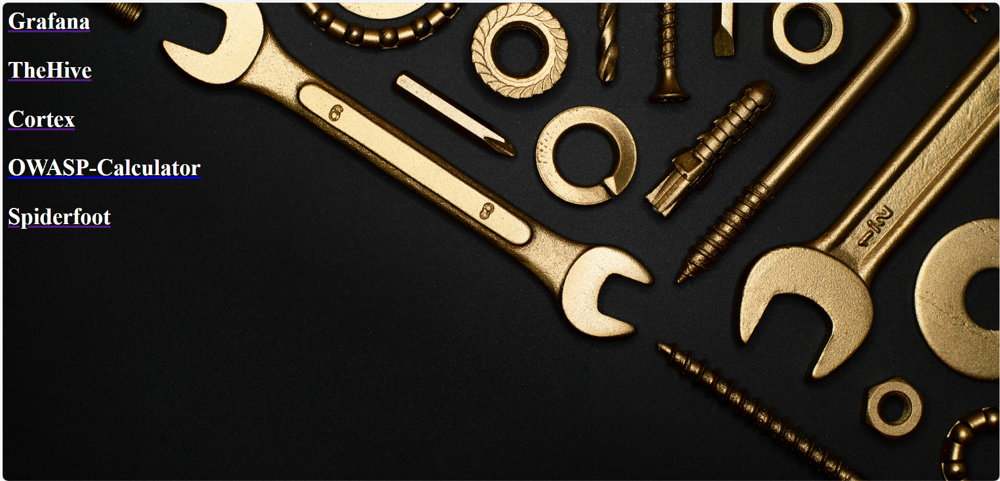

# ub1nu11: all that you need by [OPSEC](https://cyboxopsec.com/CyboxOPSEC/)
***~In development~***

ub1nu11 is a strong IT security analytics and multi-management platform containing many instruments and techniques. 
This system is compatible with Debian and Ubuntu servers - the latest versions!
For more information, please contact us.

------------------------------------------------------------------------

[](https://www.patreon.com/posts/ub1nu11-12-5-0-107475779)

- tools



- information


***WARNING: YOU NEED TO BE A ROOT USER***

------------------------------------------------------------------------

***system requirements:***

The ub1nu11 installation needs at least:

| ***8-16 GB RAM*** | ***128 GB free disk space*** | as well as a working (outgoing non-filtered) internet connection.

### Install
```
env bash -c "$(curl -sL https://raw.githubusercontent.com/nu11secur1ty/ub1nu11/master/installUB.sh)"
```
### Update:

- ***NOTE:*** When you move your machine on the other network you must use ***updateUB1nu11docker-only.sh***

```
env bash -c "$(curl -sL https://raw.githubusercontent.com/nu11secur1ty/ub1nu11/master/updateUB1nu11docker-only.sh)"
```
### Uninstall:
```
env bash -c "$(curl -sL https://raw.githubusercontent.com/nu11secur1ty/ub1nu11/master/uninstallUB.sh)"
```
-----------------------------------------------------------------------------------

- - - ***Manual run, and `shell` access & generate the other tools***
```bash
git clone https://github.com/f0rc3ps/ub1nu11.git
cd ub1nu11
docker-compose up -d
# Web testing
http://localhost:8080/
http://localhost:8080/info.php
# Shell
cd ub1nu11/
docker exec -it ub1nu11 /bin/bash
docker-compose exec ub1nu11 /bin/bash
```
- Pull
```
docker pull f0rc3ps/ub1nu11:latest
docker images
docker run -d -p 8080:80 <Image:ID>
```
- - - default user and password:
```
user: opsec
password: Pr#d@TEL#ten#sAd0brEd06l#
```
## Starting the ub1nu11 dirrectly

```bash
docker run -d -p 80:80 --name ub1nu11 nu11secur1ty/ub1nu11
```

## MySQL management

```bash
bash logininside.sh
/etc/init.d/mysql start
/etc/init.d/mysql status
mysql -uroot -ppassword
```
- Note 
`You can use your IP`!

------------------------------------------------
# Build your image

- Getting a source
```bash
git clone https://github.com/nu11secur1ty/ub1nu11.git
```
- Building a docker ub1nu11
```bash
docker build -t nu11secur1ty/ub1nu11 .
```
# Building application
```bash
bash startsamurai.sh
```
# Testing ub1nu11 
- Apache
```url
http://localhost:8080/
```

# Stop ub1nu11 
```bash
bash stopsamurai.sh
```
# Removing of the already composed ub1nu11 images
```bash
docker system prune
docker system prune -a
```
### Tools
- [Grafana](https://grafana.com/docs/grafana/latest/setup-grafana/installation/docker/)
- [Hive](https://docs.thehive-project.org/thehive/legacy/thehive3/installation/install-guide/)
- [OWASP-Calculator](https://javierolmedo.github.io/OWASP-Calculator/)
- - [GitHub](https://github.com/JavierOlmedo/OWASP-Calculator)
- [Cortex](https://github.com/TheHive-Project/Cortex)
- [Spiderfoot](https://github.com/smicallef/spiderfoot/tree/master)
- [Wazuh](https://wazuh.com/)


**Have fun** ***engineers*** ;)
